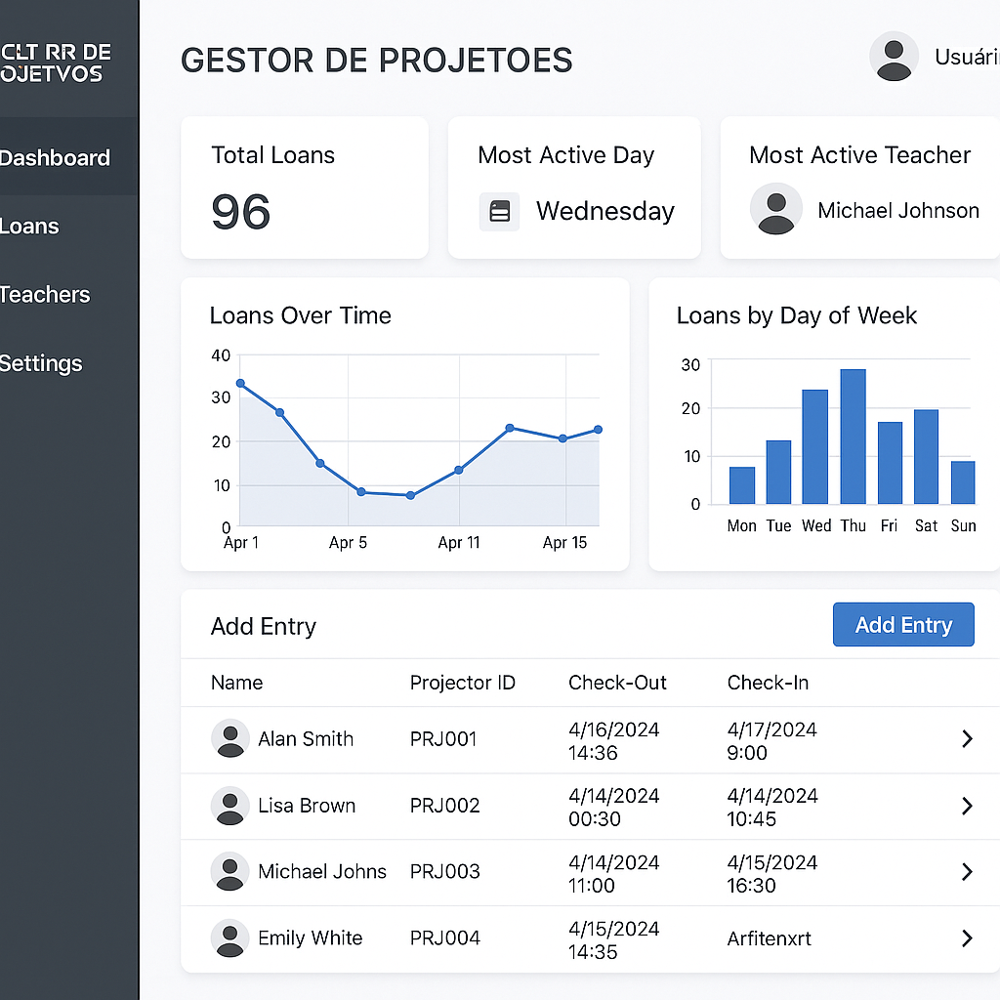

# Gestor de Uso de Projetores - UFRPE

Sistema de gerenciamento de empréstimo e devolução de projetores da Universidade Federal Rural de Pernambuco (UFRPE).

## 📋 Descrição

Este projeto é um aplicativo móvel desenvolvido em Flutter para gerenciar o controle de entrada e saída de projetores na UFRPE. O sistema permite o registro, monitoramento e controle do uso dos equipamentos audiovisuais da instituição.

## layout Idealizado

---
## 🚀 Funcionalidades Principais

- Cadastro de projetores
- Registro de empréstimos
- Controle de devoluções
- Histórico de utilização
- Gestão de usuários
- Relatórios de uso
- Notificações de devolução

## 🛠️ Tecnologias Utilizadas

- Flutter
- Dart
- Provider (para gerenciamento de estado)

## 📱 Requisitos do Sistema

- Flutter SDK (versão 3.0.0 ou superior)
- Dart SDK (versão 2.17.0 ou superior)
- Android Studio / VS Code
- Dispositivo Chrome/Navegadores para testes

## 🔧 Instalação

1. Clone o repositório:
```bash
git clone https://github.com/JamersonCarlos/gestor_uso_projetores_ufrpe.git
```

2. Entre no diretório do projeto:
```bash
cd gestor_uso_projetores_ufrpe
```

3. Instale as dependências:
```bash
flutter pub get
```

4. Execute o aplicativo:
```bash
flutter run
```

## 📦 Estrutura do Projeto

```
lib/
  ├── core/
  │     ├── theme/         # Temas e cores do app
  │     ├── routes/        # Rotas e navegação
  │     ├── utils/         # Utilitários gerais
  │     └── constants/     # Constantes globais
  ├── data/
  │     ├── repositories/  # Implementações dos repositórios
  │     └── datasources/   # Fontes de dados (APIs, local, etc)
  ├── domain/
  │     ├── entities/      # Entidades do domínio
  │     └── repositories/  # Contratos dos repositórios
  ├── presentation/
  │     ├── layouts/       # Layouts principais (Sidebar, TopBar, etc)
  │     ├── screens/       # Telas do aplicativo
  │     ├── widgets/       # Componentes reutilizáveis
  │     └── providers/     # Gerenciamento de estado
  ├── config/              # Configurações globais do app
  └── main.dart            # Ponto de entrada do aplicativo
```

## 👥 Contribuição

1. Faça um Fork do projeto
2. Crie uma Branch para sua Feature (`git checkout -b feature/AmazingFeature`)
3. Faça o Commit das suas mudanças (`git commit -m 'Add some AmazingFeature'`)
4. Faça o Push para a Branch (`git push origin feature/AmazingFeature`)
5. Abra um Pull Request


## 🙏 Agradecimentos

- UFRPE
- Equipe de Desenvolvimento
- Todos os contribuidores
